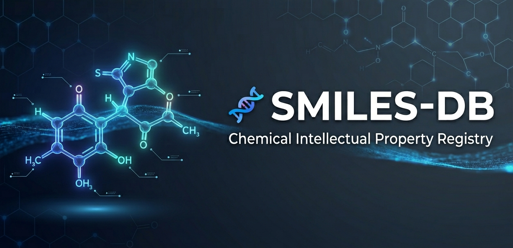

# SMILES-DB: Chemical Intellectual Property Registry (CHIPR)

[](https://www.python.org/downloads/)
[](https://fastapi.tiangolo.com/)
[](https://www.postgresql.org/)
[](./LICENSE)




## Overview

**SMILES-DB** is a sophisticated database system for registering and managing intellectual property rights in the discovery of novel chemical compounds. Built on the **[Simplified Molecular Input Line Entry System (SMILES)](https://en.wikipedia.org/wiki/Simplified_Molecular_Input_Line_Entry_System)** notation standard, this project provides a robust platform for scientists, researchers, and pharmaceutical companies to document, validate, and track chemical compound discoveries with cryptographic integrity and comprehensive metadata.

The system combines cutting-edge cheminformatics libraries (RDKit) with modern Python frameworks (FastAPI, SQLModel) to deliver a production-ready solution for chemical IP management.

---

## Architecture
```
🧪  SMILES Input -> ✅ RDKit (Validation & Canonicalization) -> 💾 PostgreSQL (Registry) -> ⚡ FastAPI
```
- **SMILES Input:** Allows sending raw smile string via a POST request.
- **RDKit:** Standardizes and validates it is both chemically possible, and novel.
- **PostreSQL:** Stores uniquely signed discoveries  with temporal signature ensure single-source-of-truth for intellectual property rights.
- **FastAPI:** Publishes data to publically facing API.

---

## Getting Started

**Prerequisites**: Python 3.11+, PostrgrSQL 14+

```bash
git clone https://github.com/jpawebb/smiles-db.git
cd smiles-db

python -m venv venv && source env/bin/activate
pip install -r requirements.txt

cp .env.example .env  # fill in your vars

createdb smiles_db
alembic upgrade head

uvicorn app.main:app --reload
```

`.env`
```env
POSTGRES_SERVER=localhost
POSTGRES_USER=postgres
POSTGRES_PASSWORD=yourpassword
POSTGRES_PORT=5432
POSTGRES_DB=smiles_db

JWT_SECRET=your-secret-key
JWT_ALGORITHM=HSA256
```

---

### Core Endpoints

#### Register New Chemical Discovery

```http
POST /discoveries
Content-Type: application/json

{
  "name": "Aspirin",
  "smiles": "CC(=O)Oc1ccccc1C(=O)O"
}

# Response: 201 Created
{
  "id": "550e8400-e29b-41d4-a716-446655440000",
  "name": "Aspirin",
  "smiles": "CC(=O)Oc1ccccc1C(=O)O",
  "molecular_weight": 180.157,
  "publisher_id": "550e8400-e29b-41d4-a716-446655440001"
}
```

#### Retrieve Discovery by ID

```http
GET /discoveries/{discovery_id}

# Response: 200 OK
{
  "id": "550e8400-e29b-41d4-a716-446655440000",
  "name": "Aspirin",
  "smiles": "CC(=O)Oc1ccccc1C(=O)O",
  "molecular_weight": 180.157,
  "publisher_id": "550e8400-e29b-41d4-a716-446655440001"
}
```

#### Database Health Check

```http
GET /health/db

# Response: 200 OK
{
  "db": 1
}
```

---

## Troubleshooting

### Invalid SMILES Error

```
ValueError: Invalid SMILES string
```

**Solution**: Ensure SMILES notation follows standard conventions. Test with:

```python
from rdkit import Chem
Chem.MolFromSmiles("your_smiles_string")
```

---

## Roadmap

- [ ] Authentication & authorization (JWT tokens)
- [ ] Advanced search & filtering capabilities
- [ ] Chemical similarity scoring
- [ ] Bulk import/export functionality
- [ ] 3D molecular visualization
- [ ] Machine learning integration for property prediction
- [ ] GraphQL API support
- [ ] Multi-language support

---

## Acknowledgments

- [RDKit](https://www.rdkit.org/) - Cheminformatics library
- [FastAPI](https://fastapi.tiangolo.com/) - Modern Python web framework
- [SQLModel](https://sqlmodel.tiangolo.com/) - SQL databases in Python
- [Pydantic](https://docs.pydantic.dev/) - Data validation
